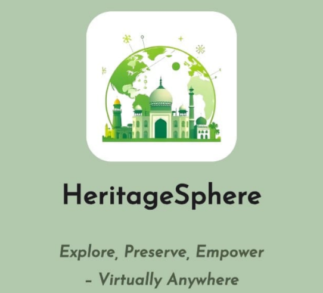

# HeritageSphere  

**Explore, Preserve, Empower – Virtually Anywhere**  

  

  

HeritageSphere is a groundbreaking platform leveraging **Metaverse, Augmented Reality (AR), and Blockchain Technology** to redefine cultural heritage exploration. It bridges accessibility gaps, combats environmental degradation, and revitalizes global engagement with heritage sites through immersive and sustainable digital experiences.  

## The Challenge  
Global heritage sites face critical challenges:  
- **Inaccessibility**: Millions cannot visit due to physical, financial, or geographical barriers.  
- **Environmental Degradation**: Unregulated tourism harms ecosystems and local communities.  
- **Cultural Disengagement**: Declining interest in preserving traditions and historical knowledge.  

## Our Solution  
HeritageSphere transforms heritage exploration by creating **inclusive, sustainable, and community-driven experiences**:  
- **Virtual Exploration**: Immersive Metaverse tours allow users to explore heritage sites from anywhere.  
- **On-Site AR Guide**: Enhances physical visits with real-time navigation, historical insights, and eco-friendly tips.  
- **Community Empowerment**: Showcases local artisans and eco-friendly products to support traditional economies.  
- **Sustainable Practices**: Blockchain-powered incentives reward users for adopting eco-conscious behaviors.  

## Features  
- **🌐 Virtual Tours**: Access 3D-rendered heritage sites in the Metaverse for an immersive historical journey.  
- **📱 AR Navigation**: Overlay historical context and sustainability tips during on-site visits via smartphone.  
- **🛍️ Artisan Marketplace**: Discover and purchase crafts directly from local communities to preserve traditions.  
- **♻️ Eco-Incentives**: Earn blockchain-based tokens for sustainable actions, redeemable for exclusive rewards.  
- **📚 Educational Hubs**: Interactive modules on cultural heritage, conservation, and ethical tourism.  

## Mission  
Our mission is to **democratize access to cultural heritage**, foster global appreciation for historical sites, and empower local communities through technology-driven solutions that prioritize sustainability and preservation.  

## How It Works  
1. **Choose Your Experience**: Select a virtual Metaverse tour or plan an on-site visit.  
2. **Engage with Technology**: Use AR for real-time guidance or explore heritage sites in 360° VR.  
3. **Support Communities**: Purchase artisan goods or participate in cultural workshops.  
4. **Earn Rewards**: Adopt eco-friendly practices (e.g., reducing waste) to earn blockchain tokens.  
5. **Track Impact**: Monitor your contributions to preservation efforts and community growth.  

## Impact  
- **Democratized Access**: Enable global audiences to experience heritage sites virtually.  
- **Environmental Protection**: Reduce tourism’s ecological footprint through guided sustainability.  
- **Community Upliftment**: Direct revenue to local artisans and conservation projects.  
- **Cultural Preservation**: Digitally archive endangered traditions and historical knowledge.  
- **Global Advocacy**: Foster a worldwide movement for ethical heritage engagement.  

**Join us in reimagining the future of cultural heritage—one virtual step at a time.**  

Made with ❤️ for a sustainable and inclusive world. 
